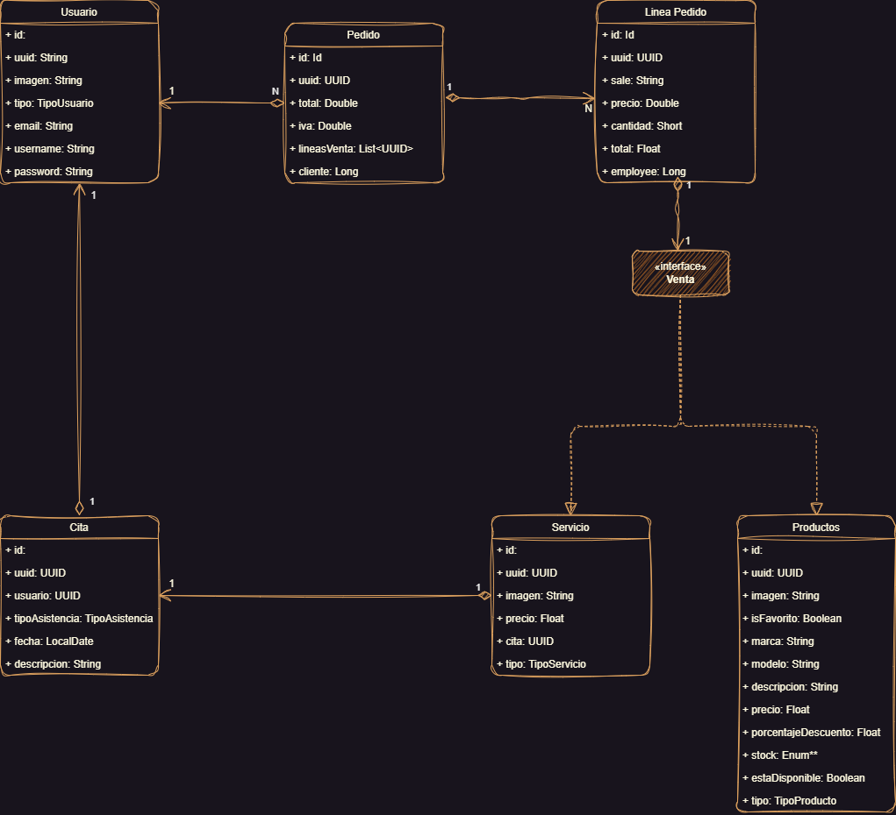

# BiquesDAM

## Problema Propuesto
Se ha creado un grupo de 6 alumnos/as de 2DAM para resolver una práctica compuesta para el módulo de Acceso a Datos y Programación de Servicios y Procesos. Como perfiles importantes necesitamos un Project Manager que represente al grupo y un Product Owner que entienda y conozca el producto a desarrollar.
El profesor de ambos módulos nos ha dado los requisitos mínimos que tiene que cumplir dicha práctica y se tratan de puntos importantes a evaluar.
Algunos de estos requisitos mínimos son los siguientes: utilizar tres gestores de bases de datos diferentes, utilizar tanto Ktor como Springboot para crear los microservicios, tener diferentes microservicios, cada microservicio implementa sus propias operaciones CRUD, todos los microservicios deben estar protegidos así como sus rutas, se debe desplegar todas las bases de datos a través de docker, alguno de los modelos debe estar cacheados.
El tiempo estimado para realizar dicha práctica será de 30 días y se entregará y defenderá en clase el día 08 de marzo de 2023.

## Diagrama de clases

## Autores
- Jorge Sánchez Berrocoso
- Daniel Rodríguez Fernández
- Alejandro Sánchez Monzón
- Mireya Sánchez Pinzón
- Sergio Pérez Fernández
- Ruben García-Redondo Marín

